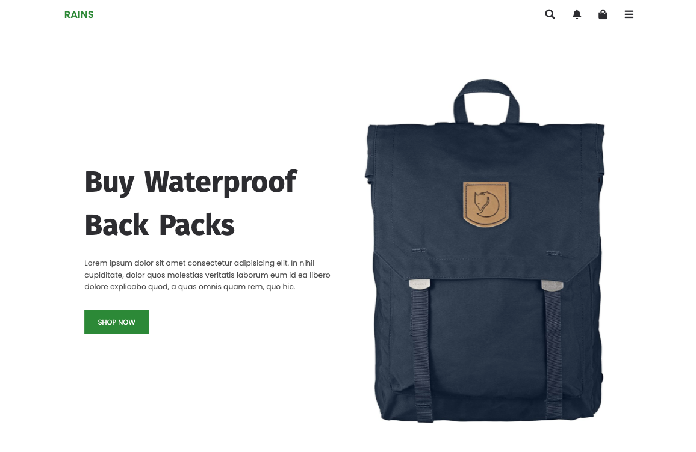

# shop-Graditest

Html, Scss, Javascripts, Webpack

- Frontend
- Response desing
- fecht API
- Diseño

[Ver la app en produccion](https://shop-graditest.netlify.app/)

## Scripts

# Frontend

cd client
`npm install` para instalar las dependencias
`npm run dev` para entorno de desarrollo
`npm run build` compilador dist

## Licencia

MIT

This project was bootstrapped with [webpack scss](https://github.com/jehingson/-shop-Graditest).
